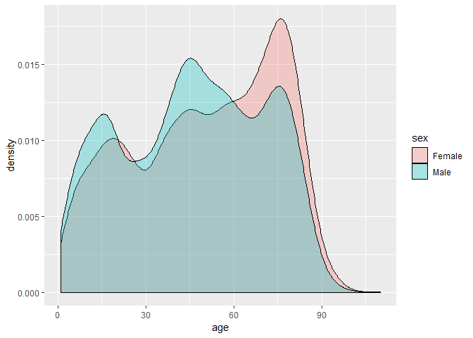

koweps
======

한국복지패널 조사(Korea Welfare Panel Study) 데이터 패키지
----------------------------------------------------------

-   한국복지패널 2017년 12차 머지 데이터(가구용, 가구원용, 장애인설문용 데이터 통합본)입니다.
-   데이터에 대한 설명은 아래 자료를 참고하세요.
    -   코딩북 : <https://www.koweps.re.kr:442/data/book/list.do>
    -   유저가이드 : <https://www.koweps.re.kr:442/data/guide/list.do>

Installation
------------

``` r
# install.packages("remotes")
remotes::install_github("youngwoos/koweps")
```

Example
-------

``` r
library(koweps)
str(welfare, list.len = 20)
#> Classes 'tbl_df', 'tbl' and 'data.frame':    15422 obs. of  1193 variables:
#>  $ h12_id          : num  1 2 3 4 4 6 6 6 6 6 ...
#>  $ h12_ind         : num  1 1 1 1 1 1 1 1 1 1 ...
#>  $ h12_sn          : num  1 1 1 1 1 1 1 1 1 1 ...
#>  $ h12_merkey      : num  10101 20101 30101 40101 40101 ...
#>  $ h_new           : num  0 0 0 0 0 0 0 0 0 0 ...
#>  $ h12_cobf        : num  NA NA NA NA NA NA NA NA NA NA ...
#>  $ p12_wgl         : num  953 1239 1282 1066 1391 ...
#>  $ p12_wsl         : num  0.287 0.373 0.386 0.321 0.418 ...
#>  $ p12_wgc         : num  948 1239 1282 1066 1383 ...
#>  $ p12_wsc         : num  0.285 0.373 0.386 0.321 0.416 ...
#>  $ h12_reg5        : num  1 1 1 1 1 1 1 1 1 1 ...
#>  $ h12_reg7        : num  1 1 1 1 1 1 1 1 1 1 ...
#>  $ h12_cin         : num  1643 1304 978 4232 4232 ...
#>  $ h12_din         : num  1642 1172 953 4172 4172 ...
#>  $ h12_flag        : num  0 0 0 0 0 0 0 0 0 0 ...
#>  $ h12_hc          : num  1 2 2 1 1 1 1 1 1 1 ...
#>  $ nh1201_1        : num  NA NA NA NA NA NA NA NA NA NA ...
#>  $ nh1201_2        : num  NA NA NA NA NA NA NA NA NA NA ...
#>  $ h1201_1         : num  1 1 1 2 2 5 5 5 5 5 ...
#>  $ h12_pind        : num  1 1 1 1 4 1 1 1 1 1 ...
#>   [list output truncated]

library(dplyr)
welfare %>% 
  select(1:5) %>% 
  head(20)
#> # A tibble: 20 x 5
#>    h12_id h12_ind h12_sn h12_merkey h_new
#>     <dbl>   <dbl>  <dbl>      <dbl> <dbl>
#>  1      1       1      1      10101     0
#>  2      2       1      1      20101     0
#>  3      3       1      1      30101     0
#>  4      4       1      1      40101     0
#>  5      4       1      1      40101     0
#>  6      6       1      1      60101     0
#>  7      6       1      1      60101     0
#>  8      6       1      1      60101     0
#>  9      6       1      1      60101     0
#> 10      6       1      1      60101     0
#> 11      8       1      1      80101     0
#> 12     10       1      1     100101     0
#> 13     10       1      1     100101     0
#> 14     12       1      1     120101     0
#> 15     12       1      1     120101     0
#> 16     14       1      1     140101     0
#> 17     15       1      1     150101     0
#> 18     15       1      1     150101     0
#> 19     15       1      1     150101     0
#> 20     15       1      1     150101     0
```

``` r
# 연령 및 성별 인구 밀도
welfare <- welfare %>%
  mutate(sex = ifelse(h12_g3 == 1, "Male", "Female"),
         age = 2017 - h12_g4)

library(ggplot2)
ggplot(welfare, aes(x = age, fill = sex)) + 
  geom_density(alpha = 0.3)
```


